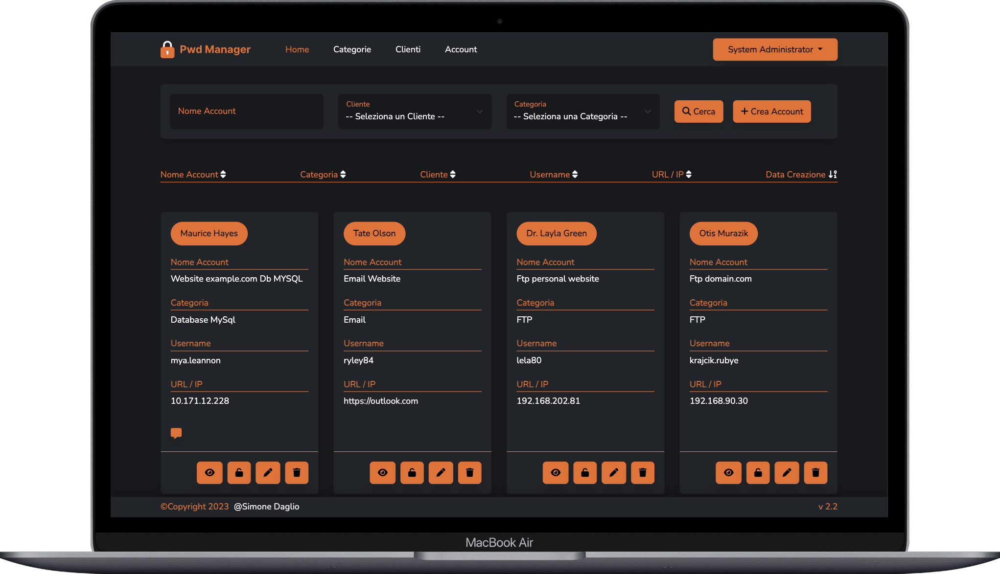

    

## Description

This password management application provides a secure environment to professionally manage and associate passwords with specific clients and categories. Role and permission management gives you precise control over access to information.

## REQUIRE
- php 7.4
- nodejs v16.10.0
- npm v7.24.0

## Installation
- cp .env.example .env
- composer install
- php artisan key:generate
- php artisan apiToken:generate
- php artisan migrate --seed
- npm install
- php artisan serve

## License

The Laravel framework is open-sourced software licensed under the [MIT license](https://opensource.org/licenses/MIT).